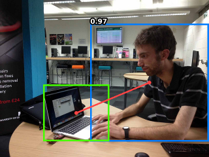
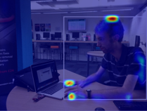
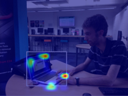
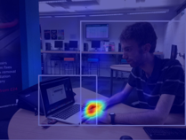

# CGC-HOI: Boosting Human-Object Interaction Detection with Coarse Geometric Cues

Note:This work is currently being submitted to the Journal of Donghua University (English version). This repository contains the official PyTorch implementation for the paper
> YAN W, TANG X S, HAO K R; _Boosting Human-Object Interaction Detection with Coarse Geometric Cues_; Journal of Donghua University (English Edition), 2025.


## Abstract
> Human-Object Interaction (HOI) detection seeks to identify and localize interactions between humans and objects. However, existing detectors often fail to incorporate coarse but informative geometric cues in a plug-and-play manner during inference. To address this limitation, we propose CGC-HOI, a two-stage detection framework that introduces geometric information into interaction reasoning. The framework integrates three complementary types of geometric cues, namely object contours, human keypoints, and bounding box representations, through a Progressive Geometric Cues Embedding (PGCE) module. In addition, a Global Context Aggregator (GCA) strengthens feature representations by combining image-level information with structured geometric cues. Together, these components generate semantically enriched query representations and provide global contextual support, thereby enhancing the model’s ability to decouple and recognize complex interactions. Extensive experiments on the HICO-DET and V-COCO benchmarks show that CGC-HOI achieves competitive performance while maintaining efficiency, underscoring the importance of incorporating geometric cues into HOI detection.

## Prerequisites

1. Use the package management tool of your choice and run the following commands after creating your environment. 
    ```bash
    # Say you are using Conda
    conda create --name CGC-HOI python=3.8
    conda activate CGC-HOI
    # Required dependencies
    pip install torch==1.8.0+cu111 torchvision==0.9.0+cu111 -f https://download.pytorch.org/whl/torch_stable.html
    pip install matplotlib==3.6.3 scipy==1.10.0 tqdm==4.64.1
    pip install numpy==1.24.1 timm==0.6.12
    pip install wandb==0.13.9 seaborn==0.13.0
    # Clone the repo and submodules
    git clone this repository
    cd CGC-HOI
    # Build CUDA operator for MultiScaleDeformableAttention
    cd h_detr/models/ops
    python setup.py build install
    ```
2. Prepare the [HICO-DET dataset](https://drive.google.com/open?id=1QZcJmGVlF9f4h-XLWe9Gkmnmj2z1gSnk).
    1. If you have not downloaded the dataset before, run the following script.
        ```bash
        cd /path/to/CGC-HOI/hicodet
        bash download.sh
        ```
    2. If you have previously downloaded the dataset, simply create a soft link.
        ```bash
        cd /path/to/CGC-HOI/hicodet
        ln -s /path/to/hicodet_20160224_det ./hico_20160224_det
        ```
3. Prepare the V-COCO dataset (contained in [MS COCO](https://cocodataset.org/#download)).
    1. If you have not downloaded the dataset before, run the following script
        ```bash
        cd /path/to/CGC-HOI/vcoco
        bash download.sh
        ```
    2. If you have previously downloaded the dataset, simply create a soft link
        ```bash
        cd /path/to/CGC-HOI/vcoco
        ln -s /path/to/coco ./mscoco2014
        ```

## Inference

Visualisation utilities are implemented to run inference on a single image and visualise the cross-attention weights. A [reference model](https://pan.baidu.com/s/1UygrYcStS9PmHAwmWLXeng) is provided for demonstration purpose if you don't want to train a model yourself. Download the model and save it to `./checkpoints/`. Use the argument `--index` to select images and `--action` to specify the action index. Refer to the [lookup table](https://github.com/fredzzhang/upt/blob/main/assets/actions.txt) for action indices.

```bash
DETR=base python inference.py --resume checkpoints/CGC-HOI-detr-r50-hicodet.pth --index image-index --action action-index
```

The detected human-object pairs with scores overlayed are saved to `fig.png`, while the attention weights are saved to `human_attn.png`,`object_attn.png`,`action_attn.png`. Below are some sample outputs.

&nbsp;&nbsp;&nbsp;&nbsp;&nbsp;&nbsp;

In addition, the argument `--image-path` enables inference on custom images.

## Training and Testing

Refer to the [documentation](docs.md) for model checkpoints and training/testing commands.

## License

CGC-HOI is released under the supervision of Donghua University Journal Center.

## Citation

If you find our work useful for your research, please consider citing us:

```bibtex
If this job is successfully accepted, we will open our reference address.
```
